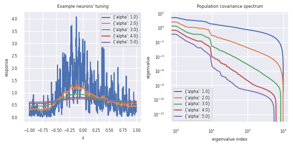
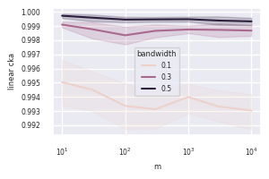
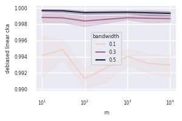
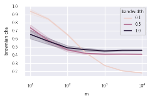
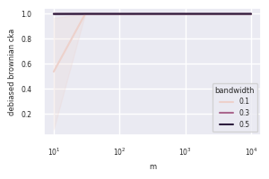
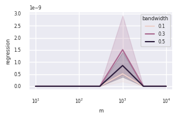

Analysis of the asymptotic bias/variance behavior of neural (dis)similarity methods on simulated data
===

## Approach to simulating data

We'd like to simulate the responses of a pair of well-controlled but random populations of neurons 
to some shared stimulus $z$. Convention for terminology is that we'll have $m$ trials where 
$z \in [-1, +1]^d$ is drawn uniformly at random, and each of a population of $n$ neurons will 
respond with some $f_i : [-1, +1]^d \rightarrow \mathbb{R}$.  

In `data_gen.py` there are two classes:

* `PowerLawFourierSynthesisNeurons`: the idea is that each neuron has a tuning function $f_i(z)$ created by Fourier synthesis:
  $$f_i(z) = softplus\left(\sum_{k=1}^K w_{ik} sin(\omega_k * \beta_k^\top z + \phi_{ik})\right) .$$
  There are effectively $K$ sinusoidal "features" at different frequencies resulting from different
  random projections of $z$ (in the code, $K$ is set to `freq_max`)$. Frequencies $\omega_k$ and 
  amplitudes $w_{ik}$ are related by a power law, so $|w_{ik}|$ goes like $\omega_k^{-\alpha}$. We
  then control the "smoothness" or "low-dimensionality" of the population by varying the `alpha`
  parameter. The softplus function is acting as a soft rectifier to keep activity positive.
* `RadialBasisNeurons`: the idea is that each neuron has some preferred value of $z$ and responds with radial basis tuning like
  $$f_i(z) = \exp\left(||z-c_i||^2/b^2\right)$$
  where $c_i$ is the "preferred" z value for neuron `i` and $b$ is the global "bandwidth" parameter.
  We then control the smoothness/dimensionality of the population by varying the bandwidth parameter.

The data-gen classes also accept a `poisson_scale` parameter which, if provided, samples the output
as a _spike count_ from a poisson distribution with `rate = poisson_scale * f_i(z)`. 

## Results (all using 1D latent and radial basis tuning)

### Asymptotic behavior of each metric as number of trials (m) increases, noiseless case

{width=2.5in}
{width=2.5in}
{width=2.5in}
{width=2.5in}
{width=2.5in}
{width=2.5in}

### Asymptotic behavior of each metric as number of neurons (n) increases, noiseless case

{width=2.5in}
{width=2.5in}
{width=2.5in}
{width=2.5in}
{width=2.5in}
{width=2.5in}

### Asymptotic behavior of each metric as number of trials (m) increases, including poisson noise

.png){width=2.5in}
.png){width=2.5in}
.png){width=2.5in}
.png){width=2.5in}
.png){width=2.5in}
.png){width=2.5in}

### Asymptotic behavior of each metric as number of neurons (n) increases, including poisson noise

.png){width=2.5in}
.png){width=2.5in}
.png){width=2.5in}
.png){width=2.5in}
.png){width=2.5in}
.png){width=2.5in}

## Method details

The following neural (dis)similarity metrics are implemented in `comparators.py`:

| Metric name                                               | Function call                                | Equation                                                                                                                   |
|-----------------------------------------------------------|----------------------------------------------|----------------------------------------------------------------------------------------------------------------------------|
| Normalized Procrustes                                     | `procrustes(x, y)`                           | $\frac{\vert\vert \Sigma_{XY}\vert\vert_*}{\sqrt{Tr(\Sigma_{X})Tr(\Sigma_{Y})}}$                                           |
| Normalized Bures Similarity                               | `bures(x, y)`                                | $\frac{\mathcal{F}(K_X, K_Y)}{\sqrt{Tr(K_X)*Tr(K_Y)}}$                                                                     |
| Unbiased Linear CKA                                       | `cka(x, y, debias="song", kernel="linear")`  | This is CKA with the unbiased estimator of HSIC (Song et al 2007) under the hood                                           |
| Less-biased Linear CKA                                    | `cka(x, y, debias="lange", kernel="linear")` | This is CKA with a $O(m^{-2})$ HSIC estimator (Lange et al 2022) under the hood                                            |
| Linear CKA                                                | `cka(x, y, debias="none", kernel="linear")`  | This is classic Linear CKA which uses an $O(m^{-1})$ biased estimator under the hood                                       |
| Brownian CKA                                              | `cka(x, y, debias=..., kernel="brownian")`   | CKA with a Brownian kernel to match the behavior of RSA on Euclidean RDMs. Same options for debiasing as above.            |
| RSA (cosine similarity of doubly-centered Euclidean RDMs) | `rsa_cosine(x, y, q=1.0, center=True)`       | $\frac{\langle{H D_X H, H D_Y H}\rangle}{\sqrt{\vert\vert H D_X H\vert\vert_F \vert\vert H D_Y H\vert\vert_F}}$            |
| RSA (cosine similarity of non-centered Euclidean RDMs)    | `rsa_cosine(x, y, q=1.0, center=False)`      | $\frac{\langle{D_X, D_Y}\rangle}{\sqrt{\vert\vert D_X\vert\vert_F \vert\vert D_Y\vert\vert_F}}$                            |
| RSA (cosine similarity of Squared-Euclidean RDMs)         | `rsa_cosine(x, y, q=2.0, center=...)`        | $\frac{\langle{D^2_X, D^2_Y}\rangle}{\sqrt{\vert\vert D^2_X\vert\vert_F \vert\vert D^2_Y\vert\vert_F}}$                    |
| Regression mean squared error                             | `regression_mse(x, y)`                       | $\frac{1}{mn}\vert\vert Y-XW\vert\vert^2_F$ where $W$ is the least-error solution, and both $X$ and $Y$ have been centered |
| Orthogonal regression mean squared error                  | `regression_mse(x, y, procrustes=True)`      | Likewise, but $W$ is constrained to be an orthonormal matrix                                                               |

where

* $||A||_*$ is the nuclear norm
* $||A||_F$ is the Frobenius norm
* $\Sigma_X$ and $\Sigma_Y$ are covariance matrices
* $\Sigma_{XY}$ is the cross-covariance matrix
* $\mathcal{F}$ is the Fidelity
* $K_X$ and $K_Y$ are kernel (Gram) matrices
* $H = eye(m) - ones(m)/m$ is the $m \times m$ centering matrix
* $D_X$ is the $m \times m$ matrix of pairwise Euclidean distances of rows of $X$ with each other, AKA the Euclidean RDM
* $D^2_X$ is likewise the RDM containing squared Euclidean distances

__The following are still to-do:__

* Cross-validated versions of the above

